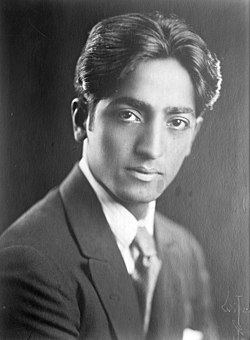
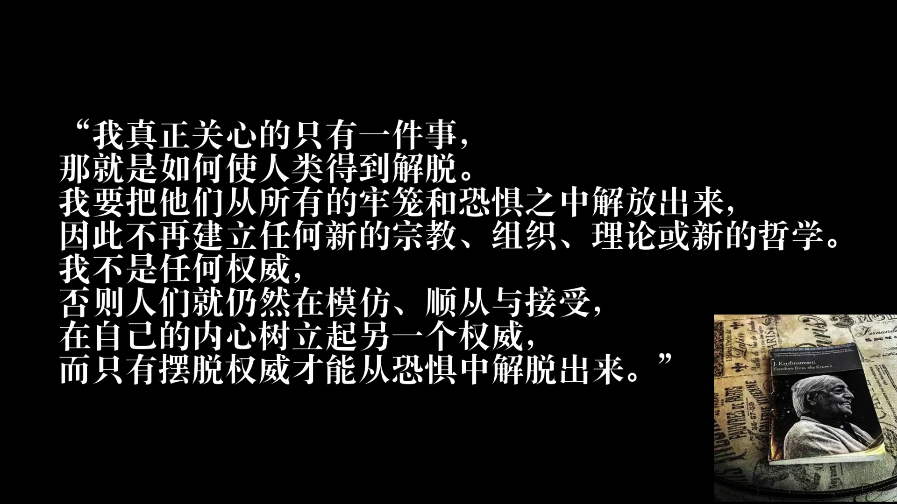

# [关于克里希那穆提](克里希那穆提.md)

吉杜·克里希那穆提（Jiddu Krishnamurti，公元1895年5月12日—公元1986年2月16日），印度哲学家。是近代第一位用通俗的语言，向西方全面深入阐述东方哲学智慧的印度哲学家。在二十世纪一度对西方哲学和宗教领域产生过重大的影响，随着互联网信息的革命，其思想近年来才被中国大陆知识分子慢慢熟知，影响力也逐步慢慢扩大。他的一生颇具传奇色彩。被印度的佛教徒肯定为“中观”与“禅”的导师，而印度教徒则承认他是彻悟的觉者。

# [克里希那穆提知识库](https://yixiaozi.github.io/Jiddu.Krishnamurti.obsidian/#/)
- 本项目目的是梳理克里希那穆提思想的逻辑。
- 克一生无数次演讲，文章也很多，但其基本思想是始终的。所以就很需要知道他到底讲了什么，一时的顿悟可能让我们兴奋，可是如果只是依靠这种片段的思维就很难真正理解，也无法构建自己的思想体系。
- 为方便大陆地区访问，添加了代理：[k.19900308.com](http://k.19900308.com/#/)
- 内容来源：
	- 大部分是克里希那穆提的演讲，书籍中的原话的摘抄。
	- 有一些文章，里面表达的思想和克一致，故采纳。资料保存至[文章]文件夹。

# 使命

> 使人类绝对的，无条件的自由。
> 我想使人自由，像晴空中的小鸟一样换欣，在那自由中，轻松独立欢喜。
> 帮助各位，以深刻而完整的具足穿越那痛苦，混乱的湍流。

